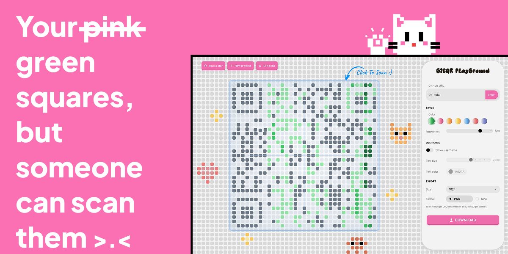
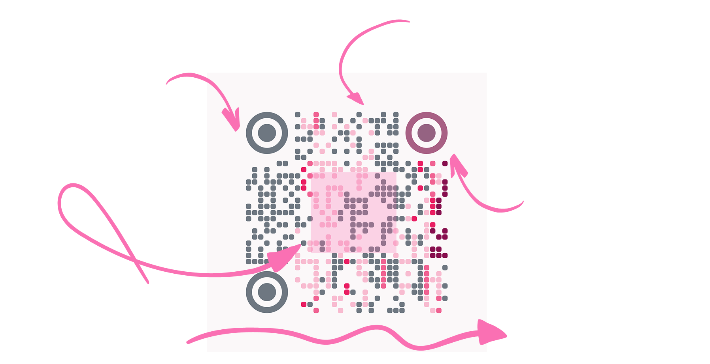
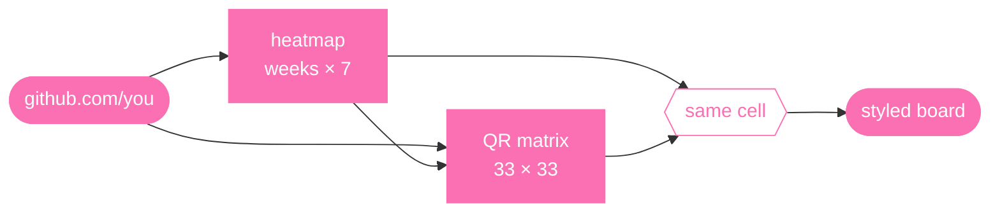
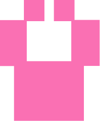

  

<a href="https://gitqr.anshu.sh">play in the playground</a>
&nbsp;·&nbsp;
<a href="public/images/cookie.png">star this for a cookie</a>
&nbsp;·&nbsp;
<a href="LICENSE">license</a>

 

## What

You know the GitHub profile heatmap. Fifty-something columns of tiny squares, each one a day you touched a repo.

GitQR takes a profile URL, pulls that same grid, and turns it into a QR code that still looks like yours. Not a generic black-and-white block. Your commits, your colors, your shape.

And it actually scans.

 

## What it looks like

<em>what an export looks like, with labels >.<</em>

  

 

## How it works

<em>paste a url. watch the board fill in.</em>

GitQR grabs your public contribution calendar and encodes the profile URL into a version-4 QR at error correction level H.

Version 4 is a 33×33 module grid, the smallest symbol that still fits a `github.com/username` link at level H. Level H is the highest error-correction tier: roughly 30% of modules can be restyled and decoders still recover the URL.

Every dark module in that matrix gets a color from your heatmap. Column maps to week. Row maps to weekday. Intensity maps to how hard you were coding that day.

GitHub's calendar is ~53 weeks wide; the QR is 33 columns. Linear resampling maps each module to a heatmap cell, so nearby weeks can collide on the same level:

$$
\text{week}(c)=\mathrm{round}\!\left(\frac{c}{32}(W-1)\right),\qquad
\text{day}(r)=\mathrm{round}\!\left(\frac{r}{32}\cdot 6\right)
$$

where $c,r$ are column and row indices ($0\ldots 32$) and $W$ is your week count (~53).

The position on the board is the position in your graph. Same grid logic, different job.

> The hard part is making it scannable while keeping the illusion.

GitQR tries all eight QR mask patterns and picks whichever keeps dark modules darkest on average. Pale colors on dark cells get a heavy penalty and kill phone reads.

Zero-contribution days that land on dark modules get forced to mid-gray instead of your palette's lightest swatch, so scanners can still separate them from the white background. Swapping palette doesn't re-encode.

 

## What you can do

<em>three things once you're on the board</em>

<table>
<tr>
<td width="33%" valign="top" style="padding: 16px 14px 0;">

<strong>scan</strong>

<ul>
<li>flip scan mode from the nav</li>
<li>board renders to canvas, runs decoders</li>
<li>resolves to your URL, you're good</li>
<li>doesn't, you know before you share</li>
</ul>

</td>
<td width="34%" valign="top" style="padding: 16px 14px 0;">

<strong>tune</strong>

<ul>
<li>seven palette presets</li>
<li>module roundness, square to soft pill</li>
<li>optional username cutout under the QR</li>
<li>size and color control</li>
</ul>

</td>
<td width="33%" valign="top" style="padding: 16px 14px 0;">

<strong>export</strong>

<ul>
<li>PNG or SVG</li>
<li>512, 1024, or 2048 px</li>
<li>roundness, palette, username label carry over</li>
<li>what you see on the board is what prints</li>
</ul>

</td>
</tr>
</table>

 

## Credits

components adapted from <a href="https://www.fluidfunctionalism.com">Fluid Functionalism</a> by <a href="https://x.com/micka_design">@micka_design</a> 
cat design inspired by <a href="https://icons8.com/">Icons8</a> illustrations

 

<em>a qr code can lose about 30% of its pixels and still scan backup data is woven through the whole pattern on purpose. that's also why slapping a logo in the middle actually works</em>

